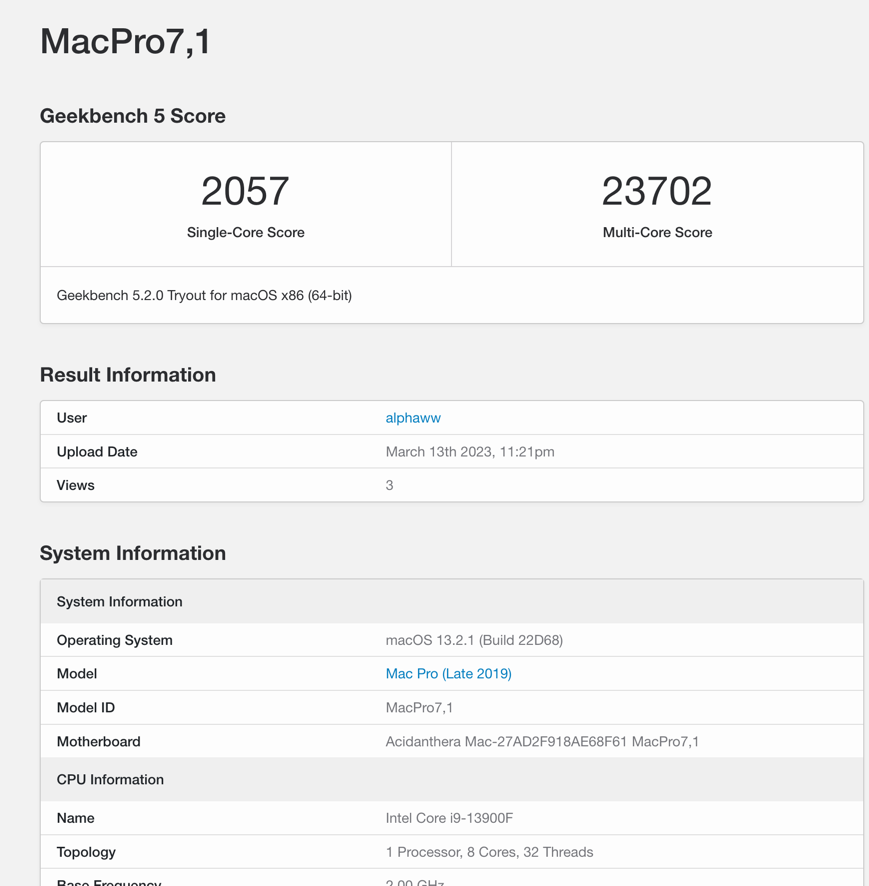
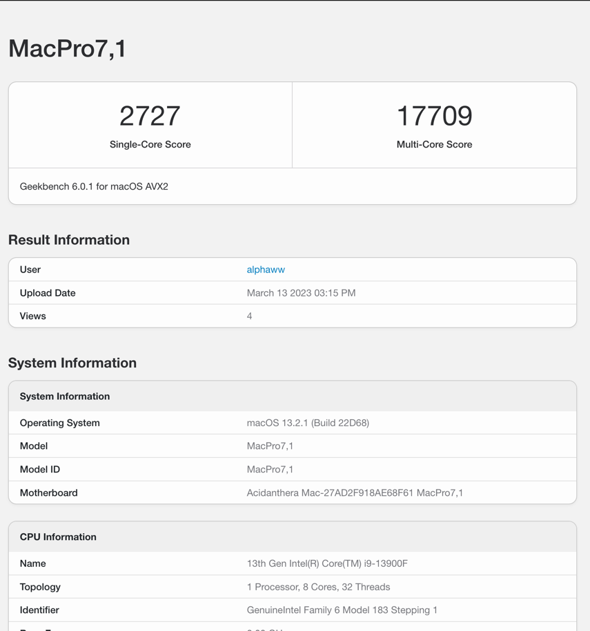

# asus-strix-b760-i-hackintosh
13900f+b760i+rx570

## geekbench 5

## geekbench 6

## opencore 0.9.0

## Hardware
- cpu 13900F
- gpu : rx570
- memory : crucial ddr5-5200 64gb(32gb*2)
- cpu cooler :  valkyrie c280w
- SSD : WD black sn850 500g*2
- motherboard : asus strix b760-i
- case : JONSBO VR3
- power supply : Corsair SF600 80PLUS Gold

## BIOS
### close
(to be continue)

### open
(to be continue)

