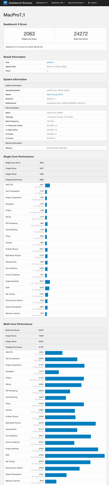
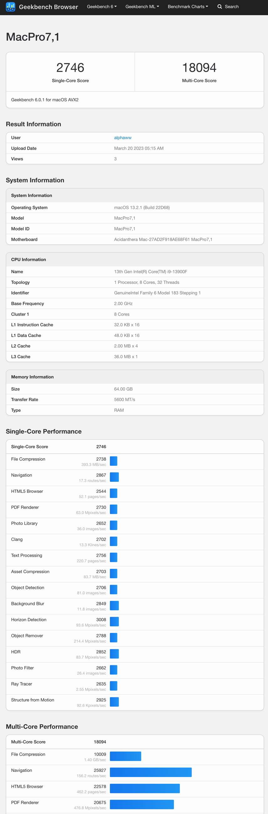
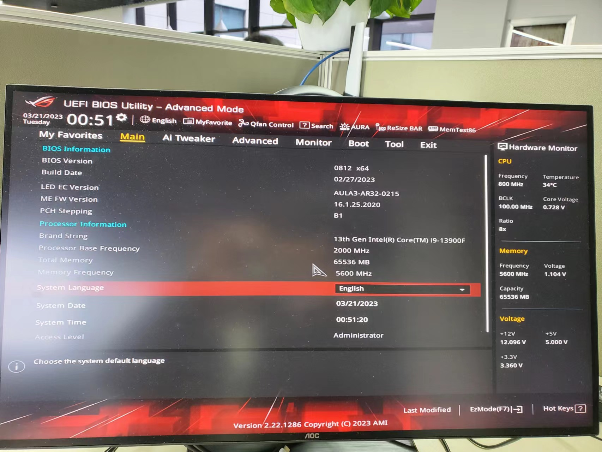
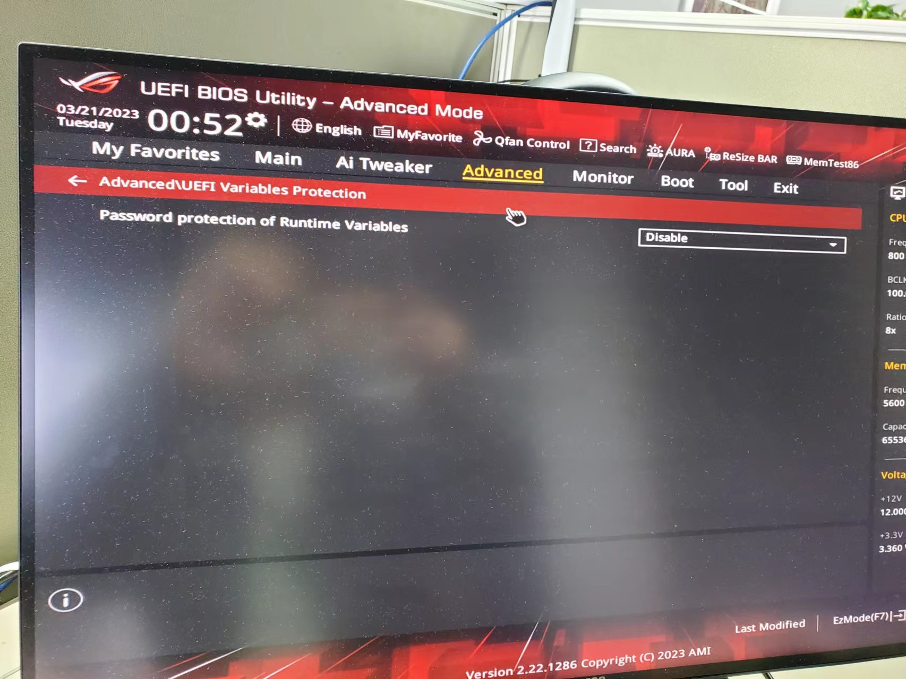
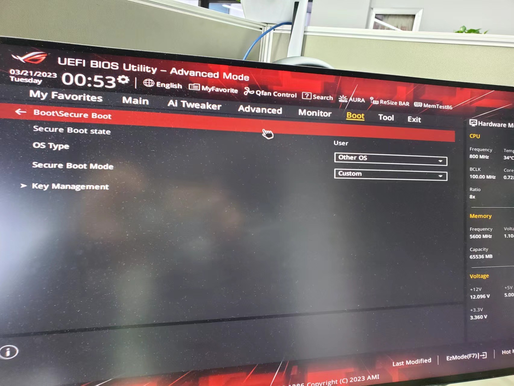
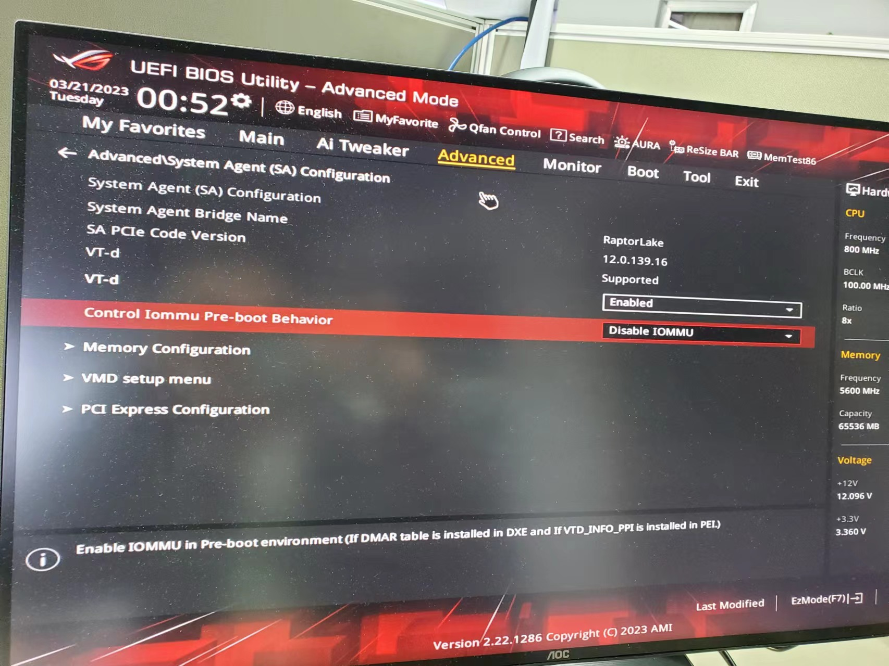
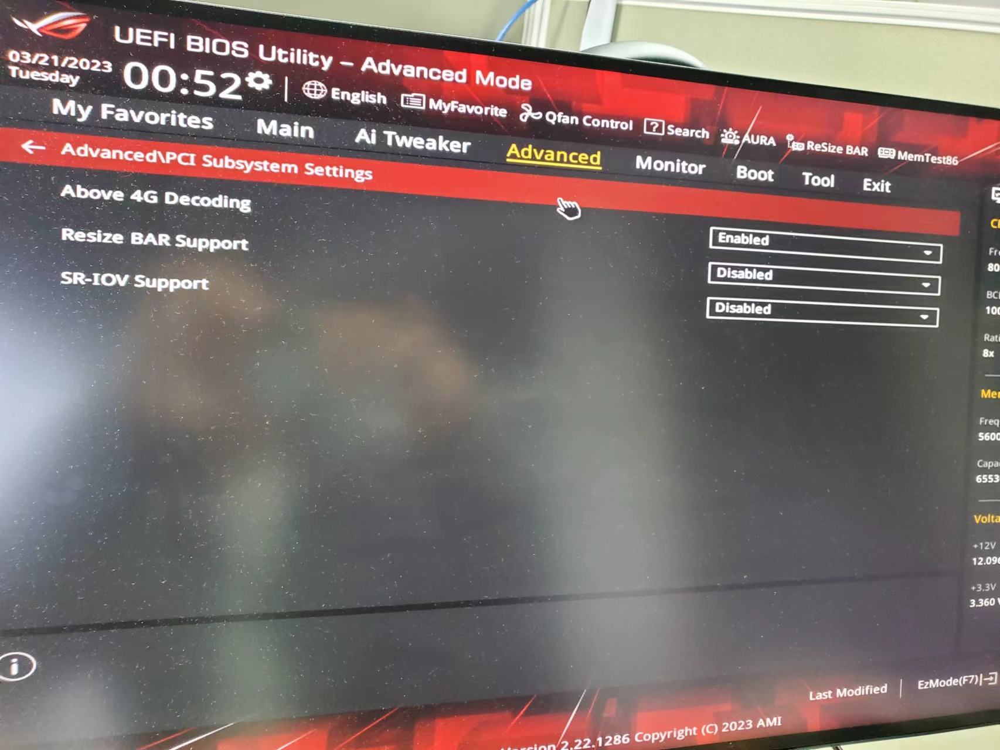
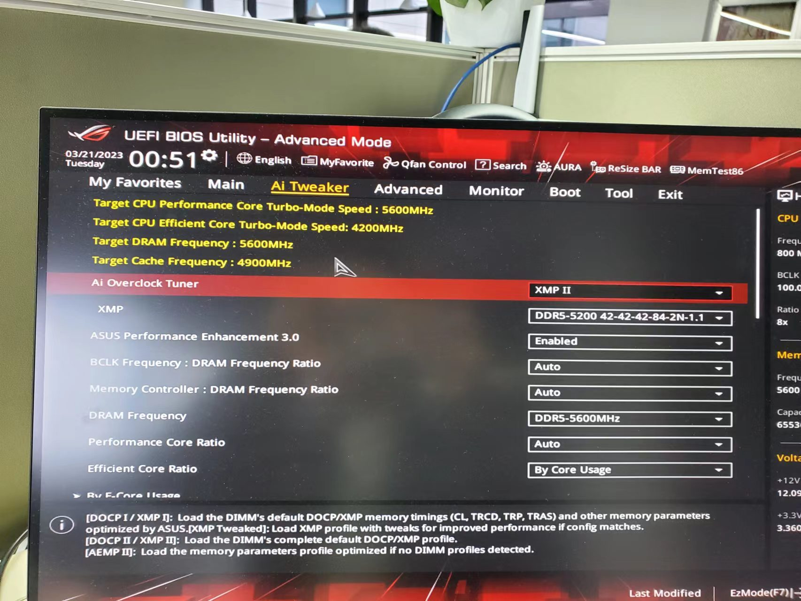
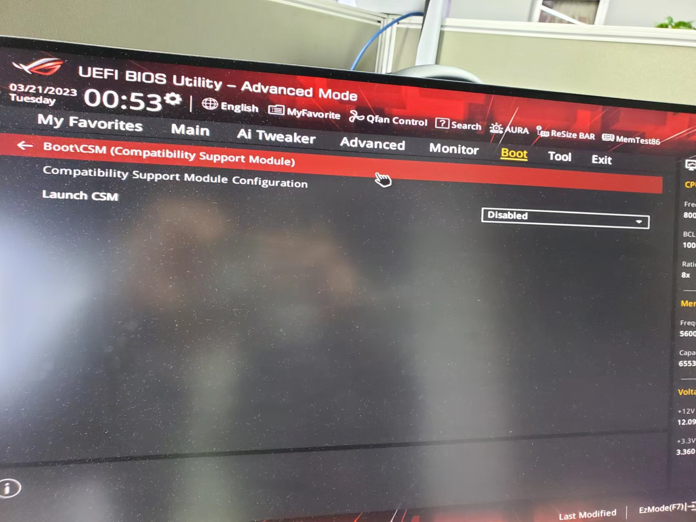

# asus-strix-b760-i-hackintosh
13900f+b760i+rx570+oc 0.9.0

## geekbench 5

## geekbench 6

## Hardware
- cpu 13900F
- gpu : rx570
- memory : crucial ddr5-5200 64gb(32gb*2)(overclock 5600)
- cpu cooler :  valkyrie c280w
- SSD : WD black sn850 500g*2
- motherboard : asus strix b760-i
- case : JONSBO VR3
- power supply : Corsair SF600 80PLUS Gold

## BIOS
### close

- Resize BAR Support
- Password protection of Runtime Variables （`If you need to close cfg-lock, it is necessary to close it here`）
- Launch CSM
- OS Type -> Other OS
- OS Type -> Custom
### open

- vt-d
- about 4G Decoding

## Unlock cfg-lock
(to be continue)